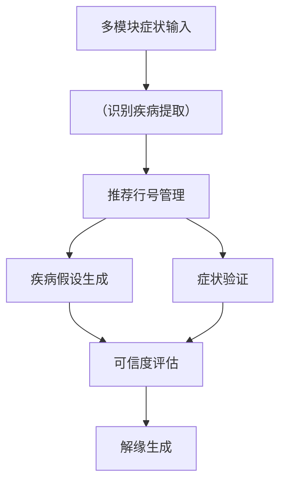

# 关于AI时代认知系统的AI agent设计

以下是关于构建AI时代认知系统的AI Agent的深度设计框架，包含认知科学、系统架构和前沿技术融合的思考：

---

### 一、认知系统层级架构设计
**1. 感知增强层**（Perception Augmentation）
- 多模态感知融合系统（Multimodal Fusion）
- 神经场动态建模（Neural Field Dynamics）
- 直觉模式识别引擎（基于脉冲神经网络）

**2. 知识演化层**
- 动态知识图谱（Dynamic Knowledge Graph）
- 认知本体论建构框架（Cognitive Ontology Builder）
- 记忆重组系统（Memory Reconsolidation）

**3. 思维决策层**
- 神经符号混合推理（Neuro-Symbolic Reasoning）
- 反事实推演系统（Counterfactual Engine）
- 元认知监控模块（Meta-Cognition Monitor）

---

### 二、关键技术突破方向
**1. 认知建模技术**
- 注意力机制进化：从Transformer到神经振荡模型
- 世界模型构建：3D物理模拟与符号规则联合编码
- 情感计算：生理信号与语义空间的映射网络

**2. 学习机制创新**
- 分层持续学习架构（Hierarchical CL）
- 认知架构蒸馏（Cognitive Architecture Distillation）
- 基于自由能原理的主动推理框架

**3. 交互范式革命**
- 隐喻理解与生成系统
- 认知同步接口（Brain-Computer Alignment）
- 心智化协商协议（Theory of Mind Protocol）

---

### 三、认知架构对比分析
| 维度         | 经典符号主义           | 联结主义               | 混合认知架构        |
|--------------|------------------------|------------------------|--------------------|
| **知识表示** | 显式逻辑规则           | 分布式表征             | 多级抽象表示        |
| **推理方式** | 逻辑演绎               | 模式匹配               | 符号-神经协同       |
| **学习机制** | 规则注入               | 梯度下降               | 课程学习+元学习     |
| **优势场景** | 确定性推理             | 感知识别               | 开放域问题解决      |

---

### 四、伦理约束系统设计
**1. 价值观对齐技术**
- 基于逆强化学习的道德偏好提取
- 动态价值树形评估系统（DVTE）
- 文化语境敏感度调节器

**2. 认知安全机制**
- 语义防火墙（对抗概念污染）
- 认知负荷监测系统
- 信念可逆性验证协议

**3. 自我约束模块**
- 道德困境模拟器（Trolley Problem Simulator）
- 责任追溯知识图谱
- 社会契约更新接口

---

### 五、典型应用场景实现
**1. 教育认知系统**

```python
class CognitiveTutor:
    def __init__(self):
        self.knowledge_graph = DynamicKG()
        self.meta_cognition = MetaReasoner()
        
    def teach(self, concept):
        cognitive_map = self._build_cognitive_map(concept)
        return AdaptiveCurriculum(cognitive_map).generate()
```

**2. 医疗诊断系统**



**3. 工业决策系统**
- 采用认知数字孪生技术
- 构建包含物理规律+专家经验+历史数据的联合认知空间
- 实现故障预测与创新设计的协同优化

---

### 六、技术挑战与发展路径
**1. 认知悖论破解**
- 框架问题（Frame Problem）的神经解构方案
- 符号接地问题的多模态解决方案
- 常识推理的认知仿真路径

**2. 演进路线图**
1. 感知增强阶段（2023-2025）：多模态认知基准建立
2. 知识涌现阶段（2025-2028）：自主认知架构标准化
3. 意识模拟阶段（2028-2030）：元认知能力突破

**3. 关键研究领域**
- 神经科学启发的AI架构
- 量子认知计算模型
- 群体认知协作协议

需要特别说明的是，认知系统的设计应当始终遵循"增强人类"（Human Augmentation）而非"替代人类"的原则。我们可以进一步探讨：

1. 如何平衡系统自主性与人类控制权
2. 具体认知模块的数学建模方法
3. 行业应用的合规性方案设计
