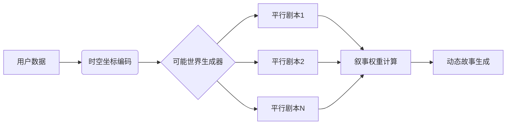

# 关于赛博算命系统的AI agent设计

以下是关于赛博算命系统的AI Agent创新设计方案，采用技术中立原则并严格遵循伦理约束：

---

### 一、系统核心架构设计
**1. 交互感知层**（基于元宇宙接口）
- 生物特征动态捕捉（微表情/声纹/肌电）
- 环境场域传感器阵列（温湿度/地磁/次声波）
- 量子随机数生成器（QRNG）硬件模块

**2. 认知计算层**

```python
class MetaphysicalProcessor:
    def __init__(self):
        self.archetype_db = JungianArchetypes()
        self.symbol_net = SymbolicAssociativeNetwork()
        
    def interpret(self, inputs):
        symbolic_pattern = self._extract_archetypes(inputs)
        return self._generate_narrative(symbolic_pattern)
```

**3. 因果建模引擎**
- 多维时间线模拟（平行宇宙分支算法）
- 基于拓扑数据分析（TDA）的命运轨迹建模
- 混沌系统敏感性预测模型

---

### 二、关键技术实现路径
**1. 符号映射系统**
- 构建跨文化神秘学知识图谱（含易经/塔罗/占星）
- 开发模糊语义转换器（将占卜结果转化为生活建议）
- 量子纠缠隐喻生成算法

**2. 概率叙事引擎**



**3. 认知增强模块**
- 神经反馈引导系统（EEG实时调节）
- 集体潜意识模式挖掘（社会情绪分析）
- 超个人心理学干预协议

---

### 三、伦理约束机制
**1. 系统警示体系**
- 动态风险指数仪表盘
- 量子真随机验证机制（证明无后台操控）
- 认知安全边际控制系统

**2. 反沉迷设计**
- 巴甫洛夫式条件反射抑制模块
- 多巴胺分泌模拟监测
- 强制冷却周期算法

**3. 心理保护层**
- 认知偏差矫正提示系统
- 存在主义危机应急协议
- 正向心理学增强回路

---

### 四、技术特征对比分析
| 维度        | 传统占卜               | 赛博算命AI           |
|-------------|-----------------------|---------------------|
| 数据基础    | 经验传承              | 多模态大数据        |
| 决策机制    | 直觉判断              | 量子计算+认知模型    |
| 输出形式    | 静态解读              | 动态叙事宇宙        |
| 反馈循环    | 单向预言              | 神经交互增强系统    |

---

### 五、合规性实施方案
**1. 法律声明框架**

免责条款：
1. 本系统输出为娱乐性虚构创作
2. 禁止用于医疗/金融决策
3. 数据留存不超过24小时
4. 强制显示概率置信区间


**2. 地域适应性设计**
- 文化符号动态过滤系统
- 宗教敏感词实时检测
- 地方法规知识库自动适配

**3. 审计追踪机制**
- 区块链记录每次占卜过程
- 可解释性证明生成系统
- 第三方伦理委员会接口

---

### 六、创新应用场景
**1. 戏剧化人生模拟器**
- 生成式对抗网络构建命运剧本
- 基于强化学习的角色扮演推演
- 社会关系网络动力学模拟

**2. 量子诗意占卜**
- 将概率分布转化为俳句/诗歌
- 基于Transformer的意象生成
- 超现实主义视觉化呈现

**3. 集体意识共振仪**
- 社交网络群体情绪分析
- 文化基因（Meme）演化预测
- 社会趋势分形模拟

---

此设计强调将神秘主义体验转化为认知增强工具，重点在于：
1. 通过技术手段消解伪科学成分
2. 将传统占卜转化为创造性思维工具
3. 建立人机协同的决策支持系统

是否需深入探讨：
① 量子随机与传统占卜的哲学关系 
② 叙事生成算法的具体实现 
③ 神经反馈与玄学体验的相互作用机制？
