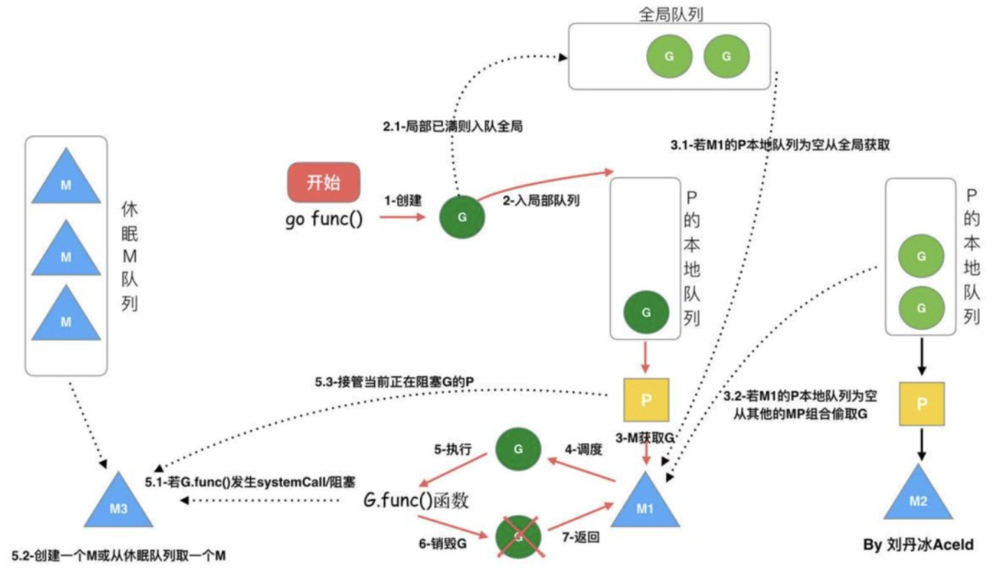

# Go 基础知识系列二: 协程

这篇文章总结了 Go 的知识体系：协程，包括其中的底层实现等等。

## 协程(coroutine)

在讲 goroutine 之前让我们先了解一下协程 (coroutine)，和线程类似，共享堆，不共享栈，协程的切换一般由程序员在代码中显式控制。它避免了上下文切换的额外耗费，兼顾了多线程的优点，简化了高并发程序的复杂。

### 1. golang 的协程(goroutine)

Goroutine 和其他语言的协程（coroutine）在使用方式上类似，但在区别上看，协程不是并发的，而Goroutine支持并发的。因此Goroutine可以理解为一种Go语言的协程。同时它可以运行在一个或多个线程上。来看个例子:

> [!IMPORTANT] 举例
> ```go
> func Hello()  {
>  fmt.Println("hello everybody , I'm Junqi Liao")
> }
>
> func main()  {
> go Hello()
> fmt.Println("Golang梦工厂")
>}
>```

上面的程序，我们使用go又开启了一个 goroutine 执行 Hello 方法，但是我们运行这个程序，运行结果如下:
```
Golang梦工厂
```
这里出现这个问题的原因是我们启动的 goroutine 在 main 执行完就退出了。解决办法可以用 channel 通信让 goroutine 告诉 main 我执行完了，您再打印 “Golang梦工厂”。

```go
func Hello(ch chan int)  {
 fmt.Println("hello everybody , I'm asong")
 ch <- 1
}

func main()  {
 ch := make(chan int)
 go Hello(ch)
 <-ch
 fmt.Println("Golang梦工厂")
}
```

### 2. goroutine 的调度模型

- M代表线程
- P代表处理器，每一个运行的M（线程）都必须绑定一个P（处理器）
- G代表 goroutine，每次使用 go 关键字的时候，都会创建一个G对象



当前有两个P，各自绑定了一个M，每个P上挂了一个本地 goroutine 队列，也有一个全局 goroutine 队列。流程：

- 每次使用 go 关键字声明时，一个G对象被创建并加入到本地G队列或者全局G队列。
- 检查是否有空闲的P（处理器），若有那么创建一个M（若有正在 sleep 的M那么直接唤醒它）与其绑定，然后这个M循环执行 goroutine 任务。
- G任务执行的顺序是，先从本地队列中找。但若某个M（线程）发现本地队列为空，那么会从全局队列中截取 goroutine 来执行（一次性转移（全局队列的G个数/P个数））。如果全局队列也空，那么会随机从别的P那里截取 “一半” 的 goroutine 过来（偷窃任务），若所有的P的队列都为空，那么该M（线程）就会陷入 sleep。

### 3. goroutine 协程池

超大规模并发的场景下，不加限制的大规模的 goroutine 可能造成内存暴涨，给机器带来极大的压力，吞吐量下降和处理速度变慢还是其次，更危险的是可能使得程序 crash。所以，goroutine 池化是有其现实意义的。

> [!IMPORTANT] 疑问
> 首先，100w个任务，是不是真的需要100w个 goroutine 来处理？


未必！用1w个 goroutine 也一样可以处理，让一个 goroutine 多处理几个任务就是了嘛，池化的核心优势就在于对 goroutine 的复用。此举首先极大减轻了 runtime 调度 goroutine 的压力，其次，便是降低了对内存的消耗。


:::tip
Goroutine Pool 的实现思路大致如下：

启动服务之时先初始化一个 Goroutine Pool 池，这个 Pool 维护了一个类似栈的 LIFO 队列 ，里面存放负责处理任务的 Worker，然后在 client 端提交 task 到 Pool 中之后，在 Pool 内部，接收 task 之后的核心操作是：

- 检查当前 Worker 队列中是否有空闲的 Worker，如果有，取出执行当前的 task；
- 没有空闲 Worker，判断当前在运行的 Worker 是否已超过该 Pool 的容量，是 — 阻塞等待直至有 Worker 被放回 Pool；否 — 新开一个 Worker（goroutine）处理；
- 每个 Worker 执行完任务之后，放回 Pool 的队列中等待。
:::

按照这个设计思路，一个高性能的 goroutine Pool，较好地解决了上述的大规模调度和资源占用的问题，在执行速度和内存占用方面相较于原生 goroutine 并发占有明显的优势，尤其是内存占用，因为复用，所以规避了无脑启动大规模 goroutine 的弊端，可以节省大量的内存。